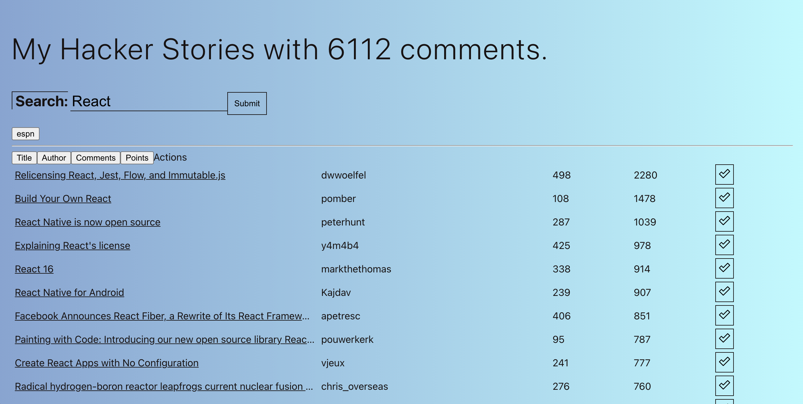

# Practice React App

This directory contains the code for a practice application I built while learning React. I came into this project with a few years of web development experience and proficiency in HTML, CSS, JavaScript, etc. This React application was built while working through "The Road to React: Your journey yo master plain yet pragmatic React.js." The book is written by Robin Wieruch and can be found [here](https://www.amazon.com/Road-learn-React-pragmatic-React-js-ebook/dp/B077HJFCQX/ref=sr_1_1_sspa?dchild=1&keywords=react%20book&qid=1606535472&sr=8-1-spons&psc=1&spLa=ZW5jcnlwdGVkUXVhbGlmaWVyPUExU0swNzFYWVo0TFQwJmVuY3J5cHRlZElkPUEwNzYwODkzQUo3MjhNUVVQWEE4JmVuY3J5cHRlZEFkSWQ9QTA3OTgzMjNKRUlETTk3NTg2V1Umd2lkZ2V0TmFtZT1zcF9hdGYmYWN0aW9uPWNsaWNrUmVkaXJlY3QmZG9Ob3RMb2dDbGljaz10cnVl).

# Tutorial Final Product
The final product of the practice application was a simple React web application for searching the HackerRank News API. Below you'll find a screenshot of the main page of the application. There is also a comprehensive lists of concepts covered while implementing this and learning React.

# React Fundamentals Concepts Learned
**Below are some key Fundamental React concepts I learned throughout implementing this practice application.**
1. Setting up a React Project (using Visual Studio Code, npm, etc.)
2. Using create-react-app and the details of the resulting file structure
3. React Components (Class and Function components), reusability
4. React JSX
5. Component Instantiation
6. React DOM
7. Handler Functions, Callback Handlers
8. React Props
9. React States (useState or useReducer)
10. React Side-Effects
11. Built-in React hooks and making Custom hooks
12. Imperative vs. Declarative React practices
13. React Fragments
14. JavaScript Destructuring
15. React Conditional Rendering
16. React Asynchronous Data and Promises
17. Avoiding React Impossible States through Reducer Functions
18. Data Fetching and Re-Fetching in React
19. Memoized Handlers
20. Using Third-Party Libraries in React and much more!

# React Styling Strategies Learned
1. Using standard CSS in React
2. Making use of CSS modules
3. Creating Styled Components in React
4. Using SVGs in React

# React Performance Strategies Learned
1. How to avoid unecessary runs on first render
2. Using React.memo and React.useCallback to avoid re-rendering if not needed
3. Using React.memo to avoid re-running expensive computations if not necessary

# React Maintenance Strategies
1. Using TypeScript to ensure type safety and code clarity in a React project
2. Performing Unit Testing in a React Application to ensure individual functions/components are working
3. Implementing Integration tests to make sure blocks of code work well together
4. Implementing end-to-end tests that simulate a user scenario (used Jest and React Testing Library)
5. Using snapshot tests to be aware of changes to components before committing code
6. Learned various React Project Structure options, proper utilization of JavaScript's import and export statements in a React project

# Advanced React Features
**These were more advanced React features that were implemented as part of exercises in the book.**
1. Sorting and Reverse sorting of results displayed in the application
2. Remembering last 5 searches in the application
3. Showing results in paginated format
4. Learned how to deploy a React application through Firebase
